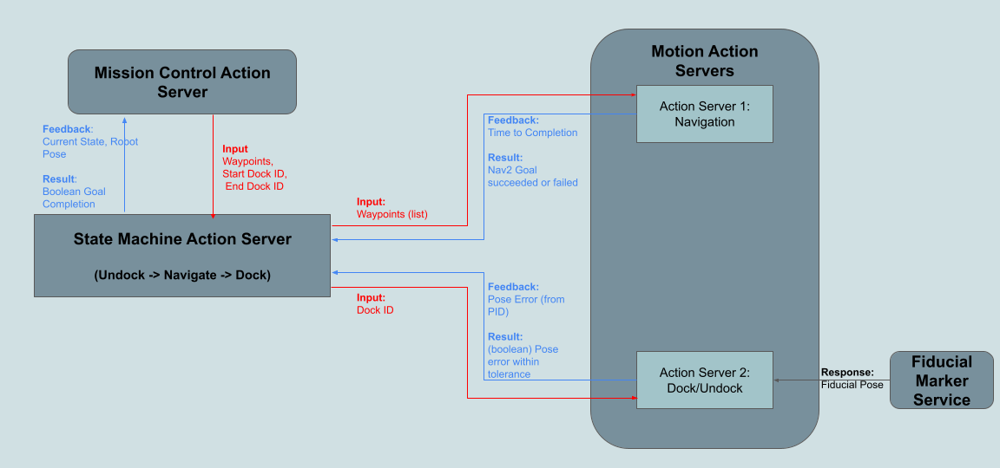

# Robot State Machine

State Machine to Change Navigation Modes

## Action Messages

The message formats are present in the robot_action_interface package
along with all other interface definitions

## Action Server Logic

The state machine follows a fixed flow of states for every navigation task. These states are:
- Undocking
- Navigating
- Docking

Each individual state has checks to wait until the action is completed. Eg. we ask pass a command
to the Undocking action server (part of robot_motion_server) and wait until that low level
action server returns done.

### High Level Logic

The action servers are part of the state machine on the robot which will call on each
action server independently


### Low Level Logic

Each action server communicates vital feedback or results which need to be propogated to
the top level nodes. This specific communication is shown below




## Launching Action Servers

```bash
# With Namespacing (multi robot)
ros2 launch robot_state_machine state_machine.launch.py use_namespace:=True namespace:="robot1"
# or
ros2 run robot_state_machine robot_state_machine_node use_namespace:=True namespace:="robot1"

# Without Namespacing (single robot)
ros2 launch robot_state_machine state_machine.launch.py
```

## Launching State Machine and Downstream Nodes

I just created this meta launch file which launches both the state machine and the motion
action servers in one launch file

```python
import os
from ament_index_python.packages import get_package_share_directory
from launch import LaunchDescription
from launch.actions import DeclareLaunchArgument, IncludeLaunchDescription
from launch.launch_description_sources import PythonLaunchDescriptionSource
from launch.substitutions import LaunchConfiguration

def generate_launch_description():
    use_namespace = DeclareLaunchArgument('use_namespace', default_value='true', description='Specify whether to use namespace')
    namespace = DeclareLaunchArgument('namespace', default_value='robot1', description='The desired namespace')

    meta_namespace = LaunchConfiguration('namespace')
    meta_use_namespace = LaunchConfiguration('use_namespace')

    motion_server_path = os.path.join(get_package_share_directory('robot_motion_server'),
                                        'launch', 'motion_servers.launch.py')
    state_machine_server_path = os.path.join(get_package_share_directory('robot_state_machine'),
                                        'launch', 'state_machine.launch.py')

    return LaunchDescription([
        use_namespace,
        namespace,
        IncludeLaunchDescription(
            PythonLaunchDescriptionSource(motion_server_path),
            launch_arguments={'use_namespace': meta_use_namespace, 'namespace': meta_namespace}.items(),
        ),
        IncludeLaunchDescription(
            PythonLaunchDescriptionSource(state_machine_server_path),
            launch_arguments={'use_namespace': meta_use_namespace, 'namespace': meta_namespace}.items(),
        )
    ])
```